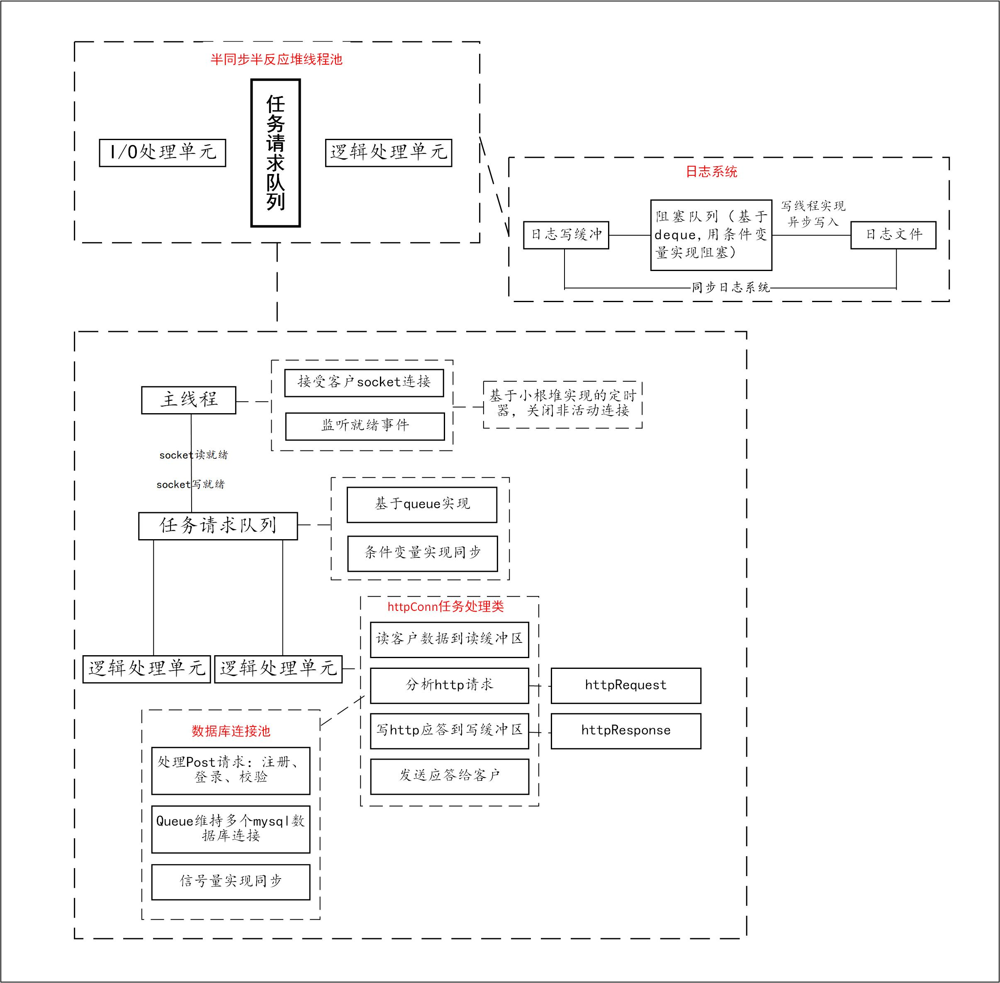

# **webServer**

基于C++实现的简单高并发web服务器。

- 使用半同步/半反应堆线程池 + 模拟的Reactor事件处理模式的并发模型
- 可以解析http GET/POST请求，并写http应答报文
- 利用mysql，支持注册，登录功能，可以请求服务器的图片、视频
- 实现同步/异步日志系统，记录服务器运行日志


# 框架




# 环境

Linux

MySQL

C++14

Make


# 目录结构

```
.
├── src                 源代码
│   ├── buffer          缓冲区类
│   ├── httpConnection  处理http连接
│   ├── logsys          日志系统
│   ├── main.cpp
│   ├── pool            线程池
│   ├── server          服务器
│   └── timer           定时器
├── study_exp           练习代码
└── test                单元测试
    ├── Makefile
    └── test.cpp
├── Makefile
├── readme.md
├── resources           资源文件
│   ├── images
│   ├── index.html
│   ├── video
│   └── welcome.html
```


# 项目运行

- 首先需要建立一个MySQL数据库，新建一个名为user的表用于记录用户名与密码，在MySQL命令行下运行：

```mysql
// 建立数据库
create database mydb;

// 创建user表，包含用户名、用户密码字段（字段名默认如下）
USE mydb;
CREATE TABLE user(
    username char(50) NULL,
    passwd char(50) NULL
)ENGINE=InnoDB;

// 可添加第一条用户数据
INSERT INTO user(username, passwd) VALUES('name', 'password');
```

- 根据需求以及本地数据库的信息修改main.cpp中webServer的参数，包括端口号、是否选择ET模式、MySQL用户名、密码、数据库名称、线程池数量、是否开启日志系统等
- 在项目根目录的终端下运行```make```编译代码，生成名为server的可执行文件，```./server```运行服务器
- 在浏览器端通过http://{服务器ip地址}:{端口号}访问服务器


# 测试

在test文件夹下可进行简单的单元测试，在终端运行：

```bash
cd test
make
./test
```

查看输出日志可以确定代码是否正常工作


# 压力测试

使用webbench可以对服务器进行压力测试，因为本人的服务器运行在虚拟机，受性能限制，压力测试的结果并不代表服务器的最大并发数量：


# 致谢

项目源码参考了[@markparticle](https://github.com/markparticle/WebServer),  [@qinguoyi](https://github.com/qinguoyi/TinyWebServer/tree/master)

练习代码来自，游双著《Linux高性能服务器编程》